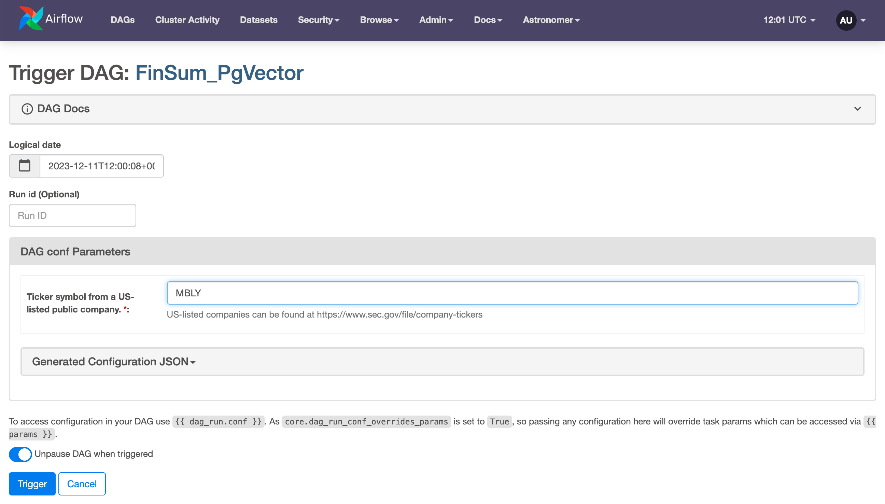
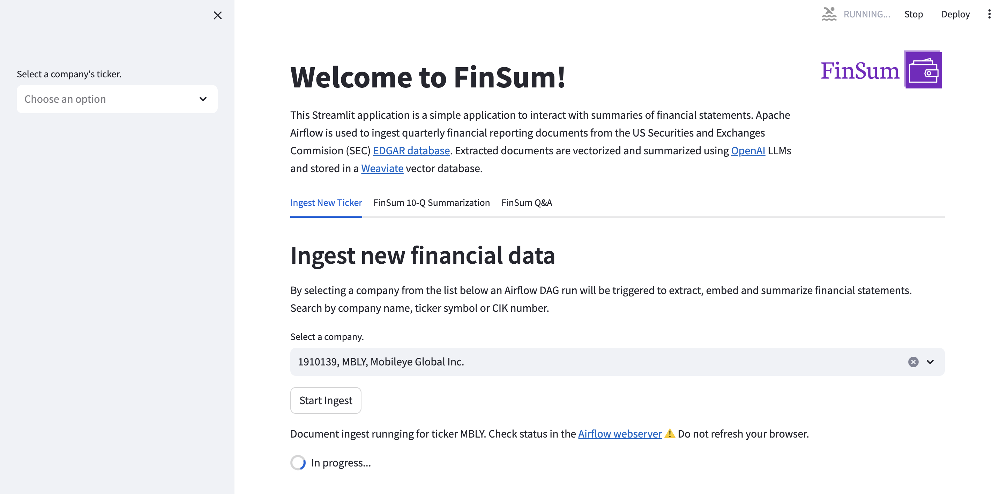

<p>
  
</p>
  
# FinSum

FinSum is a demo application for summarization of financial statements using Apache Airflow.
  
Apache Airflow is used to ingest quarterly financial reporting documents from the US Securities and Exchanges Commision (SEC) [EDGAR database](https://www.sec.gov/edgar).  Extracted documents are vectorized and summarized using [OpenAI](https://openai.com) or [Cohere](https://cohere.ai) LLMs and stored in a [Weaviate](https://weaviate.io), [Pinecone](https://pinecone.io), or [pgvector](https://www.postgresql.org/) vector database.

<br clear="right"/>

Disclaimer & Limitations  
This FinSum Demo is solely for demonstration purposes and should not be construed as legal, tax, investment or financial advice.  Nor are the summaries intended to be an accurate representation of financial reportings or company performance.

## Ingest and Embedding

The demo includes DAGs to extract, embed and ingest data to vector databases with the following Airflow Providers
- [Airflow Provider for Weaviate](https://registry.astronomer.io/providers/apache-airflow-providers-weaviate/)
- [Airflow Provider for Pinecone](https://registry.astronomer.io/providers/apache-airflow-providers-pinecone/)
- [Airflow Provider for pgvector](https://registry.astronomer.io/providers/apache-airflow-providers-pgvector/)
  
As well as DAGs extract and embed documents directly with LLM providers.  In some cases it may be beneficial to store embedded documents in files such as in cloud object storage.  These DAGs show how to generated embeddings and export to files.
- [Airflow Provider for OpenAI](https://registry.astronomer.io/providers/apache-airflow-providers-openai/)
- [Airflow Provider for Cohere](https://registry.astronomer.io/providers/apache-airflow-providers-cohere/)

FinSum uses parameterized Airflow DAGS. When starting a DAG run the user must provide a ticker symbol for a listed company.

<p>
  
</p>

<br clear="right"/>


## Prerequisites
There are many options for LLMs and vector databases. This template currently uses Microsoft Azure OpenAI for the LLMs and Weaviate vector database. To use this template you need the following:

- Docker Desktop or similar Docker services running locally with the docker CLI installed.
- [Astronomer account](https://www.astronomer.io/try-astro/) (optional)
- [OpenAI account](https://platform.openai.com/signup)
- [Cohere account](https://dashboard.cohere.com/welcome/register)
- Weaviate (Optional, see note below)
--  [Create an account or login](https://console.weaviate.cloud/)
-- Create a cluster and generate an API key
- Pinecone 
-- [Create and account or login](https://login.pinecone.io/login)
-- create a project with at least 2 pods.

NOTE: Weaviate provides a local containerized version for development.  This demo includes containerized options for weaviate as well as postgres which are deployed by the Astro CLI. See the `docker-compose.override.yml` file for configuration details.
  
## Setup

1. Install Astronomer's [Astro CLI](https://github.com/astronomer/astro-cli). The Astro CLI is an Apache 2.0 licensed, open-source tool for building Airflow instances and provides the fastest and easiest way to be up and running with Airflow in minutes. The Astro CLI is a Docker Compose-based tool and integrates easily with Weaviate for a local developer environment.

To install the Astro CLI, open a terminal window and run:

  For MacOS
  ```bash
  brew install astro
  ```

  For Linux
  ```bash
  curl -sSL install.astronomer.io | sudo bash -s
  ```

2. Clone this repository:
  ```bash
  git clone https://github.com/astronomer/airflow-llm-providers-demo
  cd airflow-llm-providers-demo
  ```

3. Create a file called `airflow/.env` with the following connection strings and environment variables.  Update values in`< >` as needed.
```
AIRFLOW_CONN_WEAVIATE_DEFAULT='{"conn_type": "weaviate", "host": "<CLUSTER_URL>", "extra": {"token": "<API_KEY>", "additional_headers": {"X-OpenAI-Api-Key": "<OPENAI_API_KEY>" }}}'
AIRFLOW_CONN_PINECONE_DEFAULT='{"conn_type": "pinecone", "login": "<ENV_NAME>", "password": "<API_KEY>"}'
AIRFLOW_CONN_OPENAI_DEFAULT='{"conn_type": "openai", "host": "", "password": "<OPENAI_API_KEY>"}'
AIRFLOW_CONN_COHERE_DEFAULT='{"conn_type": "cohere", "host": "", "password": "<COHERE_API_KEY>"}'
AIRFLOW_CONN_POSTGRES_DEFAULT='{"conn_type": "postgres", "host": "host.docker.internal", "port": 5433, "login": "postgres", "password": "postgres", "extra": {}}'
```

4. Start Apache Airflow along with local Weaviate and Postgres instances
```sh
cd airflow
astro dev start
```
The Astro CLI uses Docker Compose to instantiate a local containerized instance of Airflow. Weaviate and Postgres also provides a containerized version (for local development) which integrate easily with Astro CLI. See the `docker-compose.override.yml` file for details.

After Airflow starts a browser window that should open to [http://localhost:8080](http://localhost:8080). Log in with the following credentials:
- **username**: `admin`
- **password**: `admin`

5. Login to the Airflow UI and run the DAG for the provider of choice.  You will be prompted to add a ticker symbol.  `MBLY` is a good test option because it has only a few documents.

6. Run the DAGs in Astro Hosted: Step 10 shows an example of switching between different Weaviate instances. Follow the same approach to point Airflow at a `production` or non-temporary Weaviate sandbox. Complete the following steps to promote from Airflow running locally to a production deployment in Astro.
- Create a free [Astro trial](https://docs.astronomer.io/astro/trial) account, organization, and deployment.
- Log in to Astro from the CLI.
```bash
astro login
```
- [Deploy](https://docs.astronomer.io/astro/deploy-code) the Astro project.
```bash
astro deployment create -n 'llm-providers-demo'
astro deployment variable update -lsn 'llm-providers-demo'
astro deploy -fn 'llm-providers-demo'
```

7. This demo includes a sample Streamlit application front end.  For demo purposes it was created for the Weaviate service.  Furutre versions of the demo may inlclude applications for the other providers.

<p>
  
</p>

- Connect to the webserver container with the Astro CLI
```bash
astro dev bash -w
```
This Streamlit application is a simple application to interact with summaries of financial statements.  

- Start Streamlit
```bash
streamlit run include/streamlit/weaviate/FinSum.py
```
